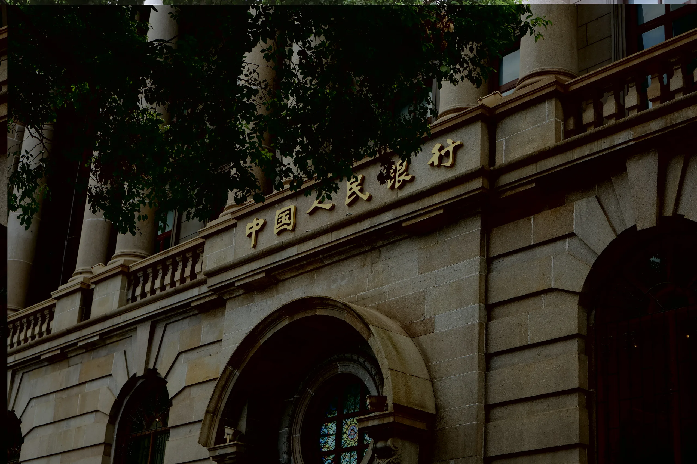
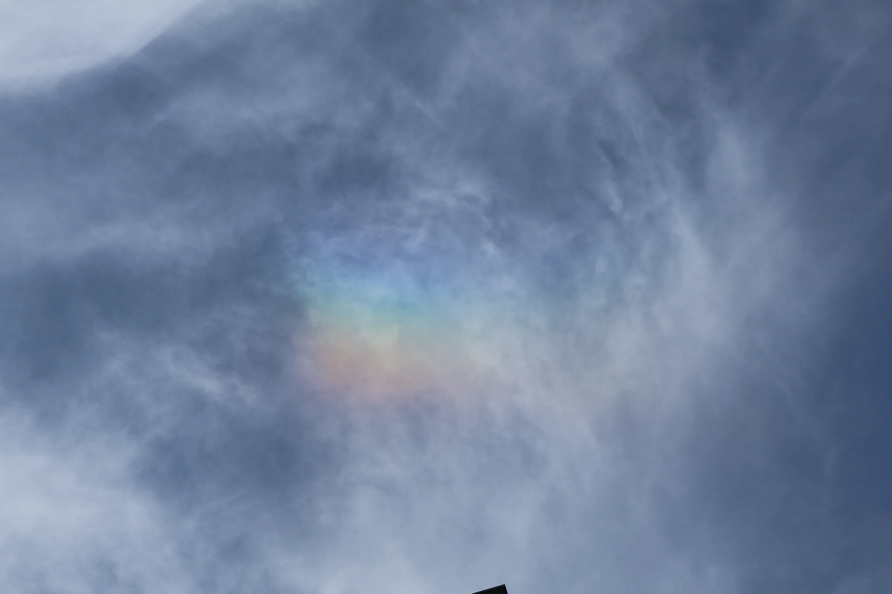
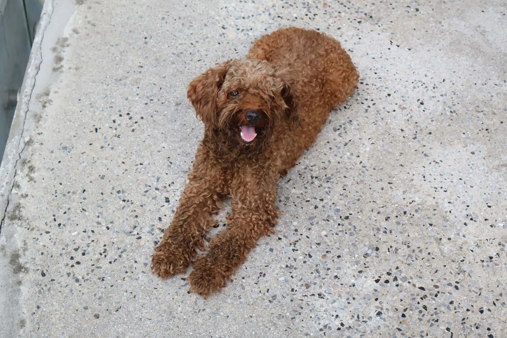
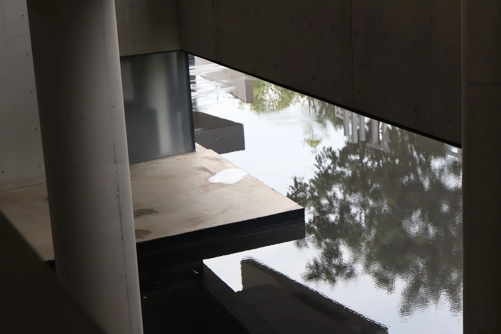
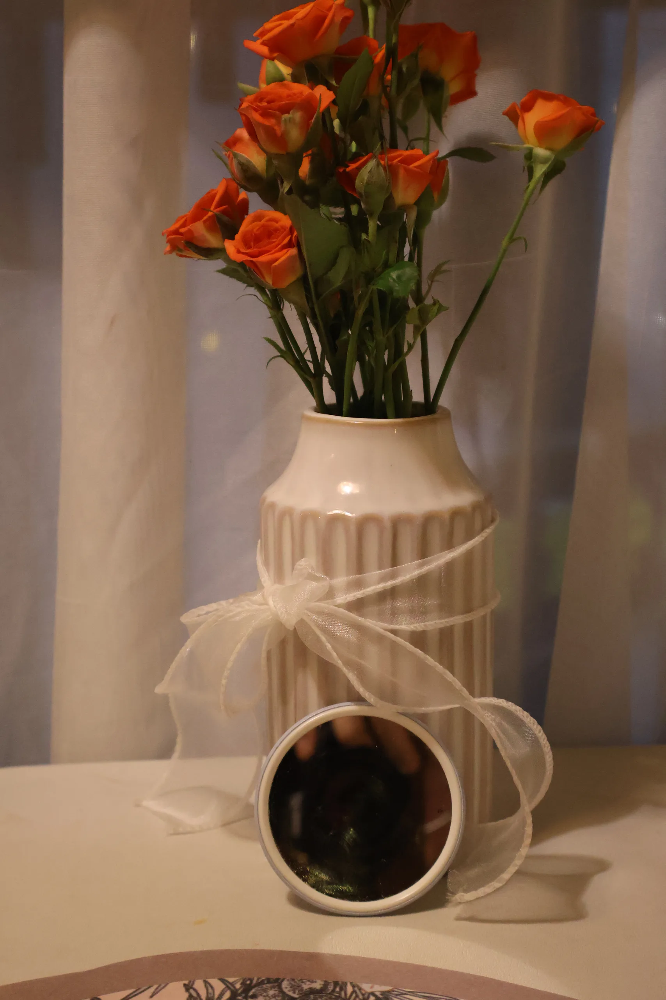
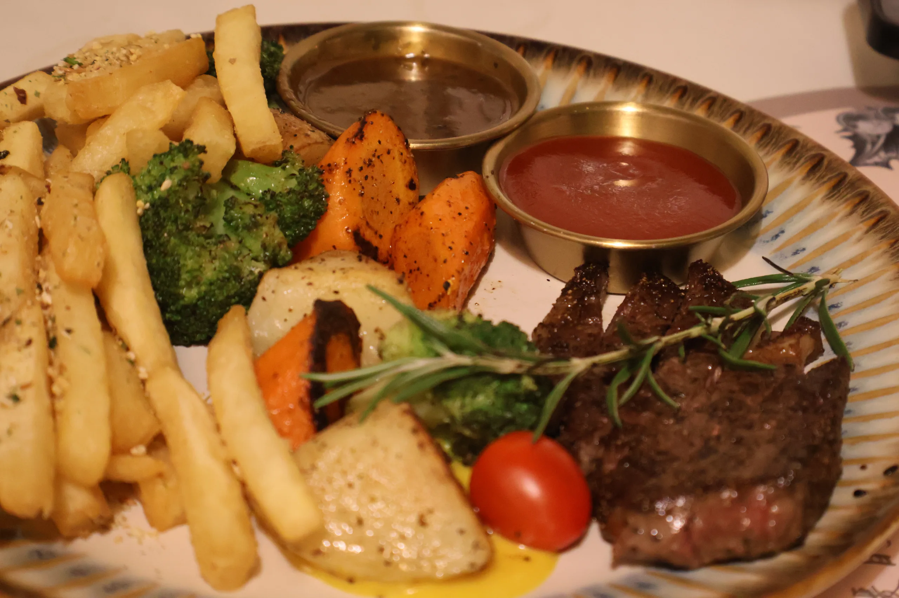
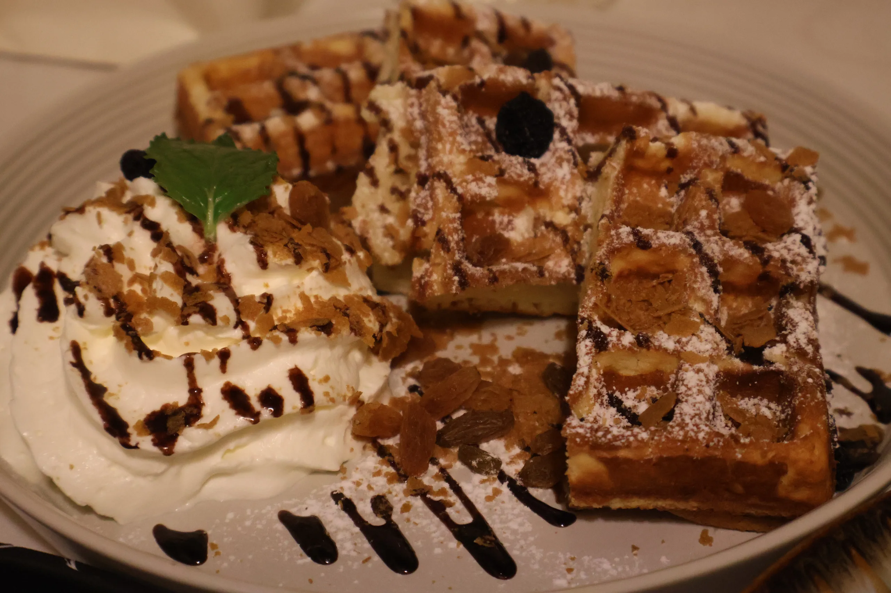
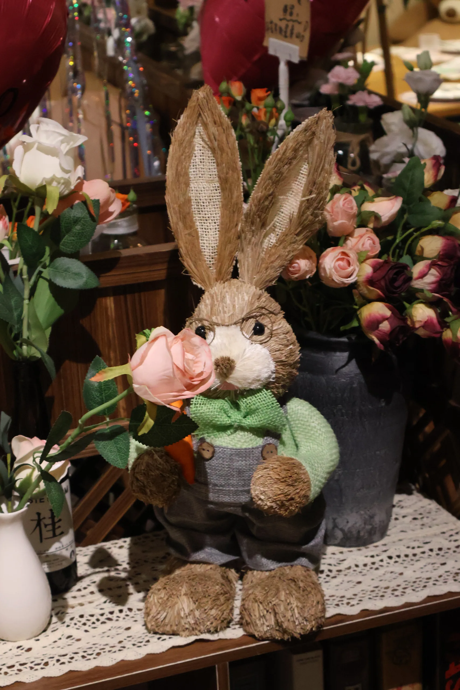

# 武汉

因为花切大会又回到了武汉。

# 小狗的故事

在便利店里买了一根烤肠。

便利店里有一只可爱的小狗狗。出便利店后，它跟着我们走了。看它可爱，应该是想要吃的，就给了一点烤肠，还在想乱喂别人家的狗狗是不是不太好。

**结果**，我们继续走，它继续跟着。直到听到一个门卫说它是流浪狗，才发觉不妙。把烤肠都给了它，希望它吃完后就不跟了。

但是它可能看上我们了，直接开始不离不弃——我们走到哪儿，它跟到哪儿。我们过马路，它也过马路。我们拍照，它就在边上转悠。我们停下，它也趴着休息。它有时候去找找吃的，但是又会立马回来跟着。我们回到原来的便利店，它还是跟我们走。门卫都说，洗一洗带回家算了。甚至去了菜市场都没甩掉它。

最后去了家有前后门的店子，小狗推不开门，才把它关在门外，从另一边走了。走的时候它还眼巴巴地看着我们。

硬是跟了我们一个小时，挺厉害的。

# 麓山下

强烈安利这家店子！

