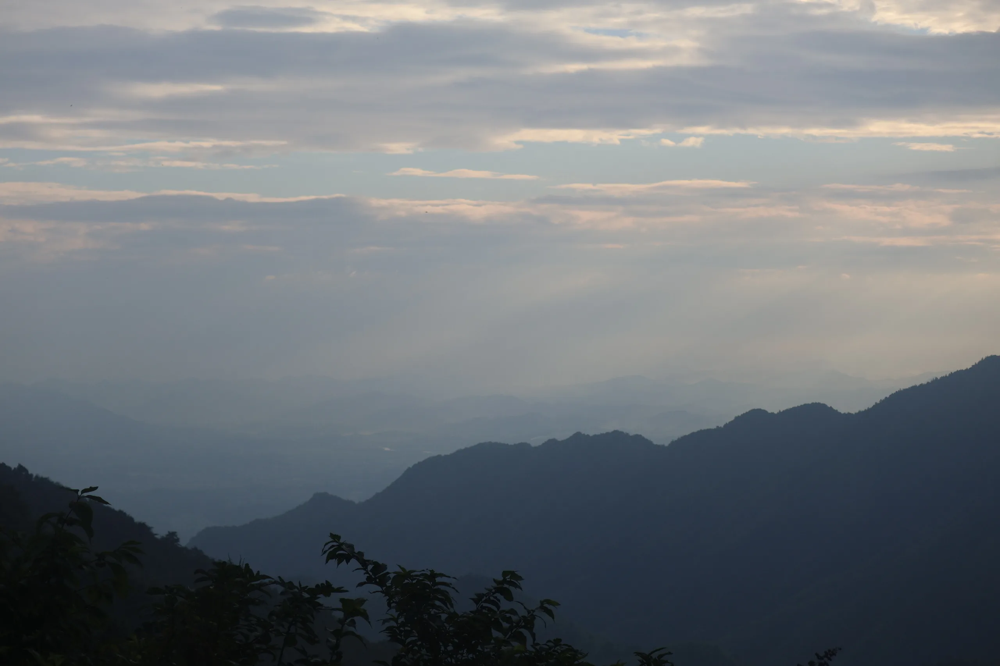
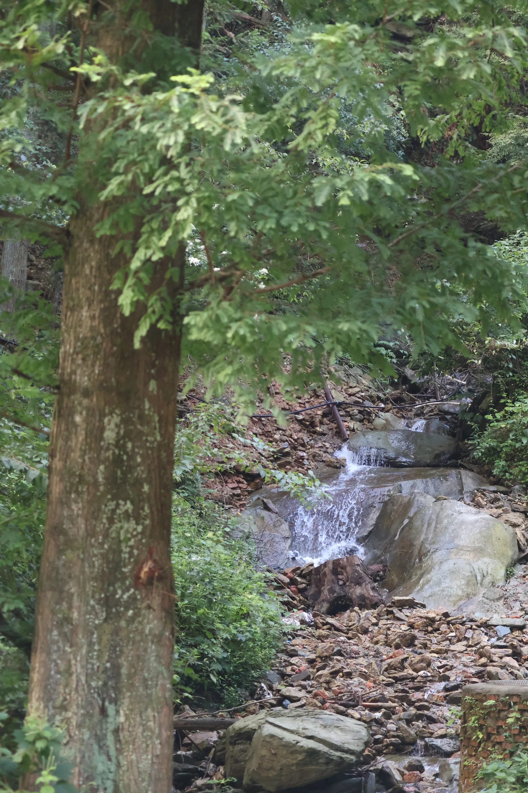
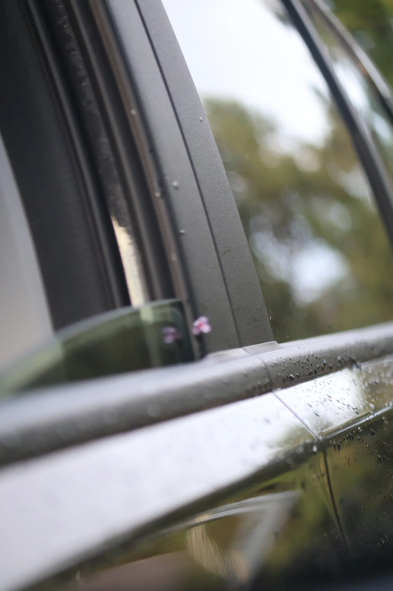

# 追星之旅

想追流星雨，顺便拍拍银河。  
一看长沙周边只有一小块地方可以，上午决定下午出发。  
自驾租车开了170多公里，上山的时候已经天黑了，下雨、起雾、大风，国道甚至是下午才开的，山路从没开过，buff直接叠满了。  

:::collage{columns=2}

:::

山上全是雾，星星自然是一点没看到。  
晚上还一直有战斗机飞过一样的声音在呼呼作响，早上起来才知道原来车停到发电的风车底下了。

:::collage{columns=2}

:::
